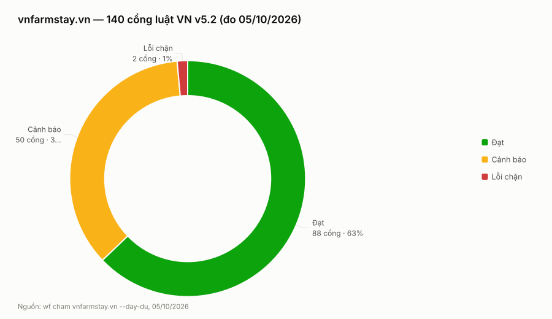

# PHIẾU KHOÁ KIỂM THỬ — vnfarmstay.vn — 05/10/2026

## Kết luận: ĐẠT CÓ ĐIỀU KIỆN

Không cổng luật nào báo lỗi chặn thật (cả 2 lỗi chặn máy nêu đều là báo oan, đối chiếu ở dưới).
Điều kiện duy nhất khiến phiếu không ĐẠT thẳng: **CI đỏ liên tiếp 5/5 lượt suốt 40 ngày** nên
không một lượt nào dựng được web — tức 40 ngày qua không có cổng máy nào gác trước khi mã lên
tên miền thật. Lỗi nằm ở một dòng script, không ở chất lượng web.

## Luật: VN v5.2 (22 trụ · 357 tiêu chí · 208 must) · Engine check-luat md5=3e660876 · Vendor md5=3e660876 · trùng gốc

## Tổng quan

| Chỉ số | Số đo |
|---|---|
| Cổng chạy | 140 |
| PASS (đạt) | 88 |
| WARN (cảnh báo) | 50 |
| FAIL (lỗi chặn) máy báo | 2 |
| **FAIL thật sau đối chiếu** | **0** |

**Nhìn ra gì:** cả hai cổng lỗi chặn đều tan sau khi đối chiếu mã thật, nên web không còn lỗi
chặn nào; nguy cơ thật của web này không nằm trong vòng tròn trên mà ở chỗ máy chấm không soi
tới — dây chuyền CI đã chết 40 ngày.

## DANH SÁCH ĐỎ (FAIL THẬT)

Không có cổng luật nào FAIL thật. Nhưng ba khoản dưới là **lỗi thật** phát hiện ngoài bảng cổng:

| # | Khoản | Chứng cứ | Mức |
|---|---|---|---|
| 1 | **CI chết 40 ngày** — `npm run lint` gọi `next lint`, lệnh đã bị gỡ khỏi Next.js 16 nên nó hiểu `lint` là tên thư mục | log lượt 35203841237: `Invalid project directory provided, no such directory: …/lint` → job Lint hỏng → **job Build bị skip** → 5/5 lượt gần nhất (26/08 → 17/09) đều `failure` | NẶNG |
| 2 | **5 route POST không có giới hạn tần suất** — `bao-sai`, `dang-farmstay`, `gsc-ping`, `indexnow`, `revalidate` | không có `src/lib/rate-limit.ts`; grep cả `checkRateLimit` lẫn `rateLimitResponse` trong `src/` đều 0 kết quả — **không phải báo oan kiểu bẫy #4** | VỪA |
| 3 | **9 lỗi HTML W3C** trên trang chủ | `aria-label` đặt trên `
` không có `role`; `<style>` trong `<body>` không phải con đầu tiên; 3 rule CSS + `@keyframes` ngoài `@scope` | NHẸ |

## Dương tính giả đã loại

| # | Cổng | Máy nói | Sự thật (bằng chứng) |
|---|---|---|---|
| 1 | `content.41-khong-so-lieu-bia` **FAIL** | "30+ tỉnh" là số liệu marketing tự chế | **Số THẬT.** `src/app/ve-chung-toi/page.tsx:8-19` ghi rõ bộ số "9+ năm · 100+ dự án · 30+ tỉnh thành · 5 mùa Xuyên Việt · 100+ điểm đến" do Ông cấp trong `vnfarmstay-nen-tang-thuong-hieu-v2.md` (08/08/2026). Bộ số BỊA cũ (500+ farmstay · 63 tỉnh · 50K+ du khách · 4.8★) đã bị gỡ từ 08/08. Đúng bẫy #10 |
| 2 | `a11y.25-contrast` **FAIL** | "thiếu culori (đã khai trong package.json) → chạy `npm ci`" | **Hỏng hạ tầng, và lời chữa của máy sai hướng**: `culori` KHÔNG hề được khai trong `package.json` của web (grep 0 kết quả), cũng không có ở CODEWEB → `npm ci` không bao giờ cứu được. Đã chạy `npm ci` trước khi chấm, vẫn thiếu |
| 3–8 | `code.1` · `code.3` · `ops.2` · `qa.6` · `qa.11` · `content.15` | "Không tìm thấy \<tệp\>" | **6 tệp đều CÓ THẬT ở gốc web** (`public/manifest.json`, `.github/workflows/ci.yml`, `README.md`, `src/app/page.tsx`) — máy dò sai gốc, đã tự gắn nhãn ⑤ |
| 9 | `seo.32-h1-single` · `seo.33-heading-hierarchy` | snapshot WARN | **Trang thật PASS** — dòng ③ bắt được: snapshot cũ hơn mã hiện tại |
| 10 | `seo.44` · `seo.45` · `exp.25-29` · `exp.33-35` | "không tìm thấy site-config.ts / .buildstate.json" | **Không phải lỗi web**: vnfarmstay dựng trước template chuẩn nên không có hai tệp đó. Máy khai đúng "KHÔNG kết luận là đạt" — đây là *chưa đo được*, không phải *sai* |

## Cách đo (dòng ①–⑤ của `wf cham --day-du`)

- **①** Snapshot `.kiem-snapshot` — chạy đủ 140 cổng
- **②** HTML thật qua `curl` — cùng khuôn `<route>/index.html`
- **③** So ①↔②: **138/140 khớp**, lệch 2 (`seo.32`, `seo.33` — snapshot cũ, trang thật đã PASS)
- **④** CI thật: `thanhtungkt7888nhd/vnfarmstay-vn`, lượt cuối 17/09 → `failure`, **5/5 lượt gần nhất đỏ** → hạ 4 cổng CI (`sec.7` · `code.3` · `qa.6` · `qa.11`)
- **⑤** 6 cổng gắn nhãn BÁO OAN THIẾU TỆP — đã `ls` xác nhận cả 6 tệp có thật

## Máy ngoài (đo trên tên miền thật)

| Công cụ | Kết quả | Ghi chú |
|---|---|---|
| Lighthouse (hiệu năng) mobile | **89/100** | LCP 3,2 s · CLS 0,002 · TBT 90 ms · FCP 2,3 s · Speed Index 3,5 s |
| W3C validator | **9 lỗi · 1 cảnh báo** | xem Danh sách đỏ #3 |
| Header bảo mật | **6/6 có** | CSP · HSTS (preload) · X-Frame-Options · X-Content-Type-Options · Referrer-Policy · Permissions-Policy |
| robots.txt | mở đúng | chặn `/api/` `/admin/`; cho phép GPTBot · ClaudeBot · Google-Extended |
| sitemap.xml | **45 URL** | khớp đúng 45 trang máy chấm đo |

CLS 0,002 là con số rất đẹp — bố cục gần như không xê dịch khi tải. LCP 3,2 s là chỗ chậm nhất.

## So sánh với lần kiểm trước

Không có — đây là **phiếu kiểm thử đầu tiên** của web này.

## Lỗi máy đo lộ ra

| # | Cổng | Máy nói | Sự thật |
|---|---|---|---|
| 1 | `a11y.25-contrast` | "culori đã khai trong package.json, chạy `npm ci`" | culori **không** được khai ở `package.json` của web lẫn CODEWEB → lời chữa dẫn người sửa đi sai đường; cần khai thật hoặc đổi thông điệp |
| 2 | `content.41` | "30+ tỉnh" là số bịa | số thật Ông cấp, có chú thích 12 dòng ngay trên mã; cổng không đọc chú thích nguồn |
| 3 | 6 cổng ⑤ | "không tìm thấy tệp" | tệp có thật — máy dò sai gốc khi chạy qua `wf cham` |

Ba khoản trên **chỉ ghi ở phiếu**. Đưa vào sổ nhà máy hoặc sửa engine (`/bao-tri-luat`) phải hỏi Ông.

## Khuyến nghị

**Cần sửa ngay (theo thứ tự):**
1. **Hồi sinh CI** — đổi script `lint` trong `package.json` sang `eslint` (Next 16 đã gỡ `next lint`). Một dòng, nhưng nó mở lại cả job Build đang bị skip 40 ngày.
2. **Thêm giới hạn tần suất cho 5 route POST** — `/dang-farmstay` là cửa nhận hồ sơ công khai, không có chặn là mời gọi gửi rác.
3. **Vá 9 lỗi W3C** — chuyển `<style>` ra khỏi `<body>`, bỏ `aria-label` trên `
` không role.

**Cần kiểm thêm:**
- `a11y.25` tương phản màu — chưa đo được lần nào; khai `culori` rồi chạy lại
- `green.1` cân nặng trang — cần build xong mới đo
- `content.40` chưa có mốc nội dung; chạy `--update-snapshot` sau khi xác nhận nội dung hiện tại đúng, để từ đó bắt được mất nội dung

**Không đụng tới:** `seo.44/45`, `exp.25-29`, `exp.33-35` — web dựng trước template chuẩn, đây là khác kiến trúc chứ không phải lỗi.

**Kiểm lại:** +1 tháng, hoặc ngay sau khi CI sống lại.

---

SKILL KẾ: `/seo-toan-dien` — đơn SEO mạng tuần này còn 8 việc chưa làm và đứng yên so với tuần trước (`01-LUAT/_DON-SEO/DON-SEO-vnfarmstay.vn-20261004.md`); phiếu này không tìm thấy lỗi chặn nào cản việc đó.
