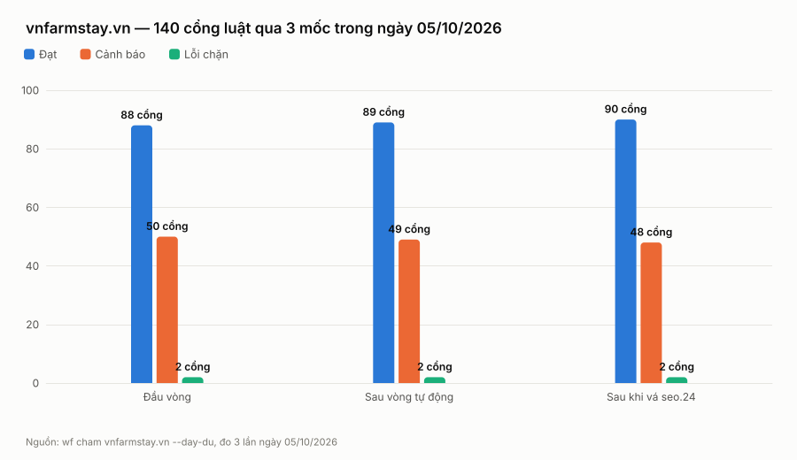

**Nhìn ra gì:** Mỗi mốc gỡ được đúng một cảnh báo thành cổng đạt, nên đường đi tuy ngắn nhưng toàn bộ là thật; cột lỗi chặn đứng yên ở 2 không phải vì vá hỏng mà vì cả hai đều là báo oan của máy đo, không gỡ bằng cách sửa web được.
